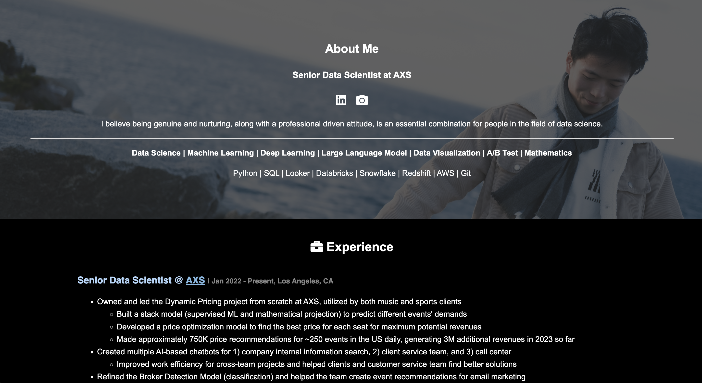

# Personal Portfolio Website

:rocket: Live demo: https://rogerzrwang.github.io/personal_website/

This repository contains a personal portfolio website template that you can use to showcase your skills, experience, and projects. The template is built using HTML and CSS and is designed to be easily customizable to fit your personal branding and content.

## Table of Contents

- [Introduction](#introduction)
- [Features](#features)
- [Usage](#usage)
- [Customization](#customization)
- [License](#license)

## Introduction

This portfolio website template is created by me, Roger, a Senior Data Scientist in entertainment industry. It provides a modern and responsive design to showcase your professional journey, skills, projects, and more. The website is divided into sections like About, Skills, Experience, Education, Publications, and Contact.

## Features

- Responsive design for various screen sizes
- Sections for showcasing your skills, work experience, education, publications, and contact information
- Easily customizable using HTML and CSS
- Back-to-top button for easy navigation
- Font Awesome icons for social media links
- Stylish header and footer

## Usage

1. Clone this repository to your local machine or fork it to your GitHub account.
2. Customize the content of each section in the HTML file to match your own details.
3. Replace the sample images with your own images or remove them if not needed.
4. Modify the styles in the CSS section to match your preferred color scheme and design.
5. Add your own social media links in the Contact section.
6. Preview the website locally by opening the HTML file in a web browser.

## Customization

Feel free to customize the template to make it your own:

- Adjust the colors, fonts, and styles in the CSS section to match your branding.
- Replace the sample images with images relevant to your skills, projects, and experiences.
- Add, remove, or modify sections as needed to highlight your strengths and accomplishments.
- Update the social media links in the Contact section to connect with your online profiles.

## License

You are free to use, modify, and distribute this template for personal projects. Attribution to me is appreciated but not required.

---

**Note:** This template is intended for educational and personal use. It's a starting point that you can build upon to create your own unique portfolio website.
